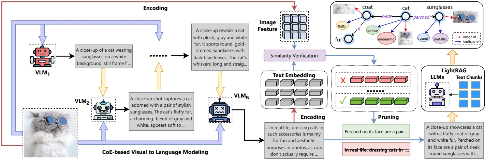

# Aligning Vision to Language: Text-Free Multimodal Knowledge Graph Construction for Enhanced LLMs Reasoning

This is an open-source implementation of VaLiK framework for enhanced LLM reasoning.

## Install