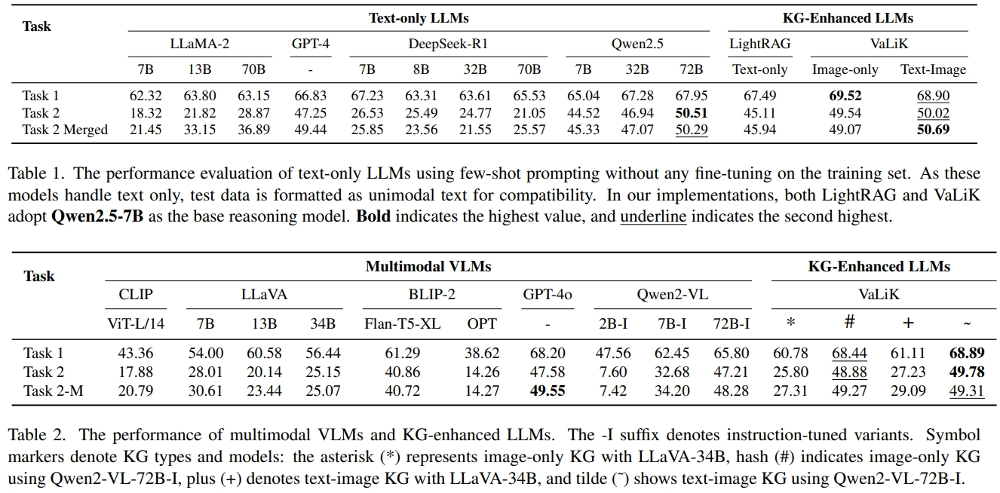

<h1 align="center">Aligning Vision to Language: Text-Free Multimodal Knowledge Graph Construction for Enhanced LLMs Reasoning</h1>

<p align="center">
    <a href="https://arxiv.org/abs/2503.12972">
        
    </a>
    <a href="https://github.com/Wings-Of-Disaster/VaLiK">
        
    </a>
</p>

## News
```2025-03-17``` 🎉🎉 Release our paper: [Aligning Vision to Language: Text-Free Multimodal Knowledge Graph Construction for Enhanced LLMs Reasoning](https://arxiv.org/abs/2503.12972).

## Release Plan
- [x] Paper
- [ ] Optimized image embedding methods
- [ ] Optimized multimodal retrieval mechanisms
- [ ] Continuously updatable MMKGs construction framework

## Introduction
In this work, we propose VaLiK, short for Vision-align-to-Language integrated Knowledge Graph, a novel framework designed to empower LLMs with advanced multimodal reasoning.
Our pipeline, as shown in the figure, consists of three parts: CoE-based Visual to Language Modeling, Cross-Modal Similarity Verification, and MMKG Construction for Enhanced Reasoning.


## Install

You can create a Conda environment and install dependencies using requirements.txt :
```bash
conda create --name valik python=3.10
conda activate valik
pip install -r requirements.txt
```
Or setup environment with provided YML :
```bash
conda env create -f environment.yml
```

To facilitate your construction of the knowledge graph, we recommend installing the `Ollama` library to download models. You can also use `vLLM `or `Hugging Face` to download the corresponding VLMs.

**Ollama**[https://ollama.com/](https://ollama.com/)

**vLLM**[https://docs.vllm.ai/en/latest](https://docs.vllm.ai/en/latest/)

**Hugging Face**[https://huggingface.co/](https://huggingface.co/)

## Usage

### CoE-based Visual to Language Modeling
We provide examples and detailed instructions in the `src/Image_to_Text` folder. You can use this module to generate descriptions for a single image or all images in a folder. The descriptions will be saved in corresponding `.txt` files with the same name as the images.

For instance, you can utilize the LLava model to process images in common formats like `.jpg`, `.jpeg`, and `.png`. You can run the following command in the terminal:
```bash
python src/Image_to_Text/LLaVA.py --input image/image_folder --model llava:7b
```

If you want to test with the dataset we used, you can run to preprocess the data.
```bash
bash datasets/Preprocess_ScienceQA.sh
```

### Cross-Modal Similarity Verification
Pruning is a double-edged sword. Whether to employ pruning techniques and what thresholds to set depend on the specific requirements of the task. Different VLMs generate sentences in various forms. We've provided relevant resources under the `src/Prune` directory for reference.
To conduct the verification, run the following command:
```bash
python src/Prune/similarity_verification.py --image_path datasets/ScienceQA/data/scienceqa/images/train/1/image.png --text_path datasets/ScienceQA/data/scienceqa/images/train/1/image.txt --threshold 0.20 --mode sentence
```

### MMKG Construction for Enhanced Reasoning
We utilize LightRAG, a lightweight framework to construct MMKGs. For comprehensive details regarding LightRAG, kindly visit the official repository: [https://github.com/HKUDS/LightRAG](https://github.com/HKUDS/LightRAG).
To construct the multimodal knowledge graph, run the following command:
```bash
python src/LightRAG/lightrag_ollama_demo.py
```
Note: Different LLMs can impact the graph construction time. We recommend using the Qwen2.5 model for graph construction as it strikes a good balance between efficiency and effectiveness.

## Performance
### Zero-Shot Multimodal Classification
On [CrisisMMD](https://crisisnlp.qcri.org/crisismmd), the classification accuracy of any LLMs enhanced by VaLiK has been significantly improved, achieving state-of-the-art performance on most tasks.


### Zero-Shot Multimodal Question Answering
On [ScienceQA](https://github.com/lupantech/ScienceQA), the text-only LLMs Qwen2.5-72B enhanced by VaLiK has achieved state-of-the-art results compared with zero/few-shot text-only LLMs, and it can also outperform most zero/few-shot VLMs. The model only has 72B parameters, and the storage scale of VaLiK only requires 489MB.


## Citation
If you find this repository useful, please consider giving a star ⭐ and citation.
```
@article{Liu_2025_VaLiK,
  title={Aligning Vision to Language: Text-Free Multimodal Knowledge Graph Construction for Enhanced LLMs Reasoning},
  author={Liu, Junming and Meng, Siyuan and Gao, Yanting and Mao, Song and Cai, Pinlong and Yan, Guohang and Chen, Yirong and Bian, Zilin and Shi, Botian and Wang, Ding},
  journal={arXiv preprint arXiv:2503.12972},
  year={2025}
}
```